# Coursera_Capstone
Capstone project - Coursera IBM Data Science
HTML version of final code:
https://htmlpreview.github.io/?https://github.com/cnako/Coursera_Capstone/blob/master/HTML%20-%20Capstone%20Project%20-%20COVID%20Houston.html

16-Jun-2021

## Introduction

### Background

In the early months of 2020 few people could imagine the magnitude of the pandemic. The COVID-19 quickly spread throughout the world becoming a truly global pandemic. As a new disease to which the world has never seen such reach and lethality in 100 years, no government had a clear view on how to respond to the pandemic.

### Problem

In light of that, in order to have effective heath measures, policy makers need to have a good understanding of how customer facing business, either retail, restaurants, bars and others, relates with COVID-19 spread. The objective of this report is to use available COVID cases in Houston and Foursquare business location data to understand what is the relation between COVID-19 cases across Houston and the number of businesses in each region so that policy makers can take this to create effective measures to curb COVID-19 spread.

## Data Sources and Cleaning

### Data Sources

For this analysis, the following data was used:
•	Number of COVID-19 cases by ZIP code in Houston 
•	ZIP code location in Houston
•	Commerce data from Foursquare
The analysis as well as the data extraction, either download or scraped, was done in a Jupyter Notebook using Python 3.7 in IBM Watson Studio (IBM, 2021). The sources of these data are from a couple of sites. Below are the sources and a brief description.

### ZIP code location in Houston

The data for the ZIP code location are sourced from ZipAtlas (ZipAtlas, 2020) which is a company specialized in Zip code for US.
The data is retrieved directly from the website and converted to a table to be used on the analysis.

### Number of COVID-19 cases by ZIP code in Houston

The data for the number of COVID-19 cases are sourced from 'City of Houston COVID-19 Data Hub' (Harris County Public Health, 2021). This data is gathered by Houston Heath Department and is available to the general public.

The data used is downloaded as a table ready to be used. The table has 'Total number of cases', 'Confirmed Cases', 'Active Cases', 'Recovered' and other metrics by ZIP code.

### Commerce data form Foursquare

Business data comes from Foursquare (Foursquare, 2021). To do that, ZIP location data are used to retrieve the Foursquare data. After retrieving business data for each ZIP code, they are combined into one single table.

## Data Cleaning

The data downloaded or scraped from those sources had to be cleaned before they could be used for this analysis. For each of the data sources a different cleaning process had to be done before they could be used. Below is a description of how each data source was prepared for use.

### ZIP code location in Houston

The data from ZipAtlas (ZipAtlas, 2020) was extracted directly from the website and once it was extracted there was no extra cleaning up done before the data was ready for the analysis. In order to extract the data BeautifulSoup was used to scrape the table with ZIP codes.

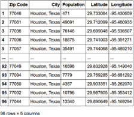
*Figure 1: Sample of Houston Zip Code table after extraction.*

### Number of COVID-19 cases by ZIP code in Houston

The data from 'City of Houston COVID-19 Data Hub' (Harris County Public Health, 2021) was downloaded directly as a csv file type. From the initial table, a number of columns have parameters that are not relevant for the analysis itself such as ‘State’ and ‘DATE_MOD’. From the initial 22 columns, 11 were removed to prepare the data for this analysis. At this stage no rows were excluded as there was no empty data points.

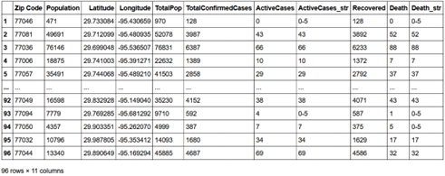
*Figure 2: Sample of Houston COVID-19 Cases Table.*

### Commerce data form Foursquare

The Foursquare data (Foursquare, 2021) had to be pulled by Zip Code as JSON file and then combined. In order to do that, the zip code data from ZipAtlas was used as reference to pull the data. Once it was pulled, the data was combined.

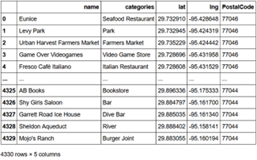
*Figure 3: Sample of Foursquare data combined after pulled by Zip Code.*

The categories parameter in the Foursquare are set in a hierarchy (Foursquare, 2021) but when the location data is pulled, only the lowest level is shown in the dataset. This results in over 500 categories in the data pulled while at the highest level of the category hierarchy, there are 10 categories. To enhance the commerce data, the foursquare category hierarchy data was pulled and organized in a table. 

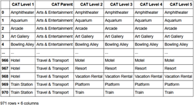
*Figure 4: Sample of Foursquare Category Hierarchy*

After the Foursquare category hierarchy, this data was joined to the Foursquare commerce data.

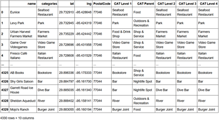
*Figure 5: Sample of Foursquare Commerce Data with Category Hierarchy*

The last step prior to the analysis was to group the Foursquare commerce data by one of the category levels. For this analysis, the data was grouped by the parent category.

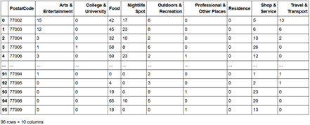
*Figure 6: Sample of Foursquare commerce data group by Category.*

### Analysis Table

To prepare the Foursquare commerce data the Zip Code was combined with the Foursquare data. As a later step, this commerce data was merged to the COVID-19 cases for the analysis.

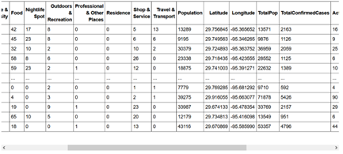
*Figure 7: Analysis table sample.*

## Data Exploration & Methodology

Once the analysis table is gathered together, it is possible to explore the data. Firstly, we can investigate the relationship between the number of venues and the number of cases.

## Number of venues and COVID-19 cases relationship

The simple way to verify the relationship between number of venues and cases is to plot them in a scatter plot. Two possible charts are the number of venues against the number of cases and the number of venues against the ratio between number of cases and venues.

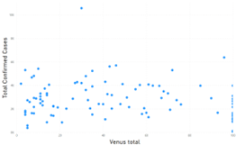
*Figure 8: Cross-plot between Venues against Cases*

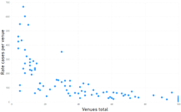
*Figure 9: Cross-plot between Venues against Rate of cases per venue*

In the cross-plots it is possible to visually check the relationship between venues and cases. The venues against cases plot doesn’t clearly show a relationship between them. In the other side, the cross-plot between venues against ratio of cases by venue clearly shows that the ratio does not remains constant when venues change as it would be in a linear relationship. As the relationship between venues and COVID cases is not clear, an exploration at a lower level would be valuable.

### Venue drilldown and COVID-19 cases relationship

As mentioned previously, the venue categories in the initial foursquare data table (Foursquare, 2021) are at a very granular level and for this analysis we used the parent category. When the venues are grouped at the parent category it is possible to rank then and start the analysis with the relevant categories. 

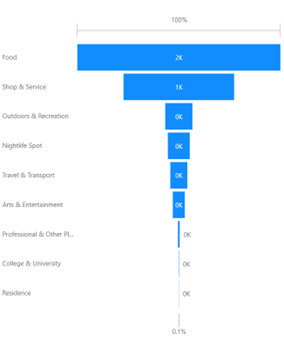
*Figure 10: Number of venues per parent category*

When a similar cross-plot is done for the top 3 categories, Food, Shop & Service and Outdoors & Recreation, a similar pattern emerges on each of the categories. As with the total venues, the drilled down venue categories don’t show a clear relationship between the number of venues and the number of COVID-19 cases.

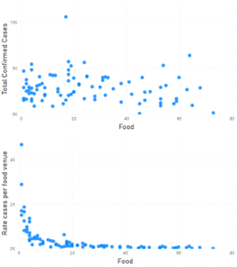
*Figure 11: Cross-plots with Food category*

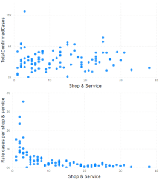
*Figure 12: Cross-plots with Shop & Service category*

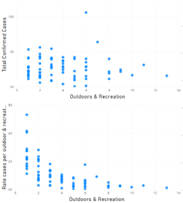
*Figure 13: Cross-plots with Outdoors & Recreation category*

The cross-plot shows that it is not possible to show a clear relationship between the number of COVID-19 cases and the number of venues of a given Zip Code. It would be interesting to drill down even further but this reduces the number of the data points as not every Zip Code has every type of venues. Even at the parent category level, the number of neighborhoods with each category reduces as we move to the categories with less venues overall. 

The plot of the number of venues by type per zip code highlights what was just described.

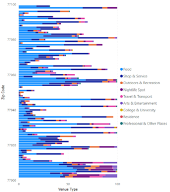
*Figure 14: Number of venues by type per zip code*

## Results

The data exploration showed that there’s no clear relationship between COVID-19 cases and number of venues by zip code. This is not to say that the number of venues had no impact in the number of the COVID-19 cases but this indicates that other factors have a higher impact on the number of cases than the number of venues.

It is possible to cluster the neighborhoods by the number of COVID-19 cases and number of venues which allows to visualize how close together the similar clusters are. When this is done as in the map in Figure 15, it is possible to see that out of the 5 clusters, the first 3 with lower levels of COVID-19 cases (red, purple, light blue) are mostly close to each other. While the higher levels of COVID-19 cases (light green and yellow) are spread across the city.

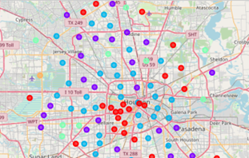
*Figure 15: Houston map clustered by number of COVID cases*

## Recommendations

At this point it is not possible to create a final policy based on the number of COVID-19 cases and number of venues by zip code alone. It is clear that using number of venues as the sole parameter to define how to define policies against COVID-19 is not a wise decision. As a follow up for this study, it is recommended to add other parameters that might not be straight away obvious or related to a virus spread such as household income. This can be found in places such as Houston state of health (Houston State of Health, 2021).

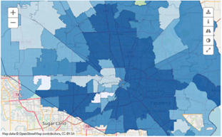
*Figure 16: Houston Median Household Income by Zip Code*

## Conclusion

This study was showed that the COVID-19 spread is not a simple problem and that public authorities should devote resources to properly understand it to promote effective public policies. For this report 3 data sets from distinct sources were used to understand if there was a direct relation between the number of COVID-19 cases and the number of venues in a given zip code of Houston, TX. The combined data was then used to explore the relation between the number of cases and number of venues. This showed that there was no direct relationship between the two. This could have been from several factors, from the complexity of the COVID infection to Houston’s city model with cars favored over public transport, large venues and others. In order to better understand the relationships between the disease factors contributing to it’s spread a larger study should be performed, which is beyond the scope of this project.

## References

Foursquare. (2021, 06). Places API. Retrieved from Foursquare Developers: https://api.foursquare.com/v2/venues/explore?client_id={}&client_secret={}&ll={},{}&v={}&radius={}&limit={}
Foursquare. (2021, 06 10). Venue Categories. Retrieved from Foursquare: https://docs.foursquare.com/docs/legacy-venue-categories
Harris County Public Health. (2021, 06 16). Download COVID Cases By Zip Codes. Retrieved from Harris County / City of Houston COVID-19 Data Hub: https://covid-harriscounty.hub.arcgis.com/datasets/081f346d4b9b43d88fcdc79e2e6c4517_0/explore?location=29.833797%2C-95.435187%2C10.33
Houston State of Health. (2021). Median Household Income. Retrieved from http://www.houstonstateofhealth.com/indicators/index/view?indicatorId=315&localeTypeId=3&periodId=4523&
IBM. (2021). IBM Watson Studio. Retrieved from IBM Data Platform: https://dataplatform.cloud.ibm.com
ZipAtlas. (2020). Population Density in Houston, TX by Zip Code. Retrieved from ZipAtlas: http://zipatlas.com/us/tx/houston/zip-code-comparison/population-density.htm

